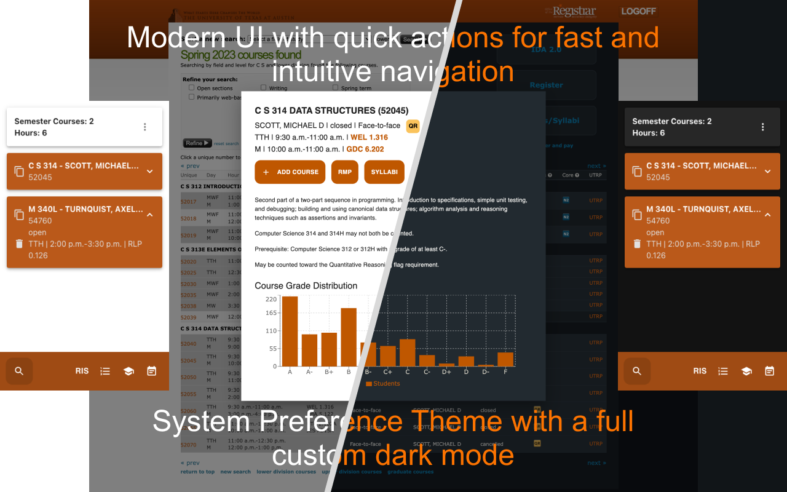
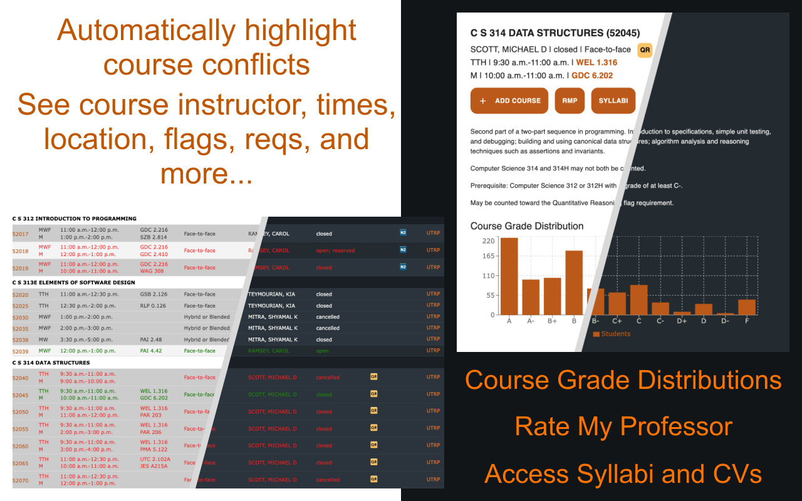
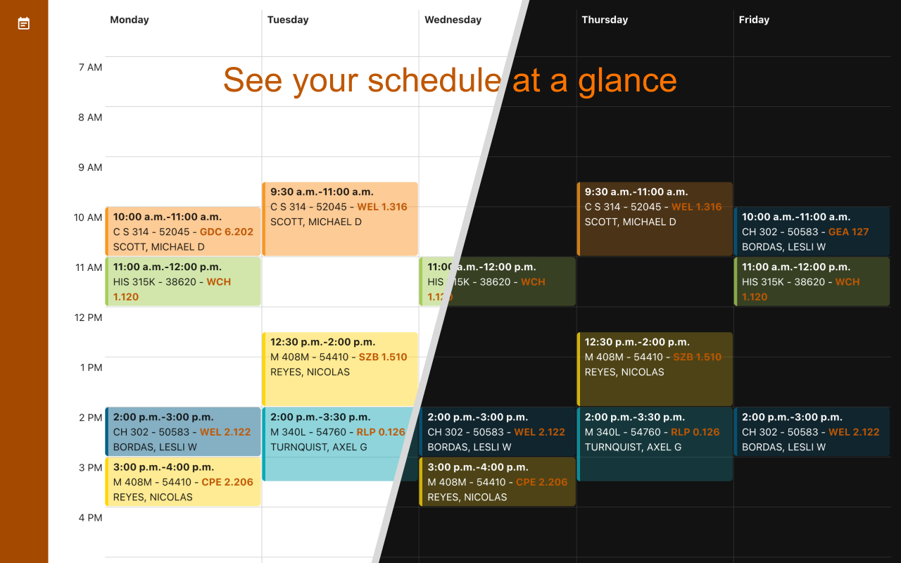

# UT-Registration-Planner

## About
UT Registration Planner is a Chrome Extension designed to improve the course registration process at The University of Texas at Austin.

## Features
Course registration doesn't have to feel like shopping for Black Friday anymore.

UT Registration Planner features automatic course conflict highlighting and a modern UI for a fast and intuitive experience registering for courses while featuring a full light or dark mode theme based on your system preference.

Clicking the `UTRP` button will open a modal that shows course information such as:
- Instructors
- Times
- Locations (with a link to the location which opens in a new tab)
- Flags
- Requirements
- Grade distributions
- Rate My Professor link
- Access Syllabi and CVs link
- and more!

The quick actions bar opens commonly used tabs for registration with a single click and each course card displays course info at a glance while expanding to show more information or to copy the course unique ID for easy sharing.

The course list calendar shows your color coded schedule at a glance and features links to course locations to help you plan out your schedule efficiently.

